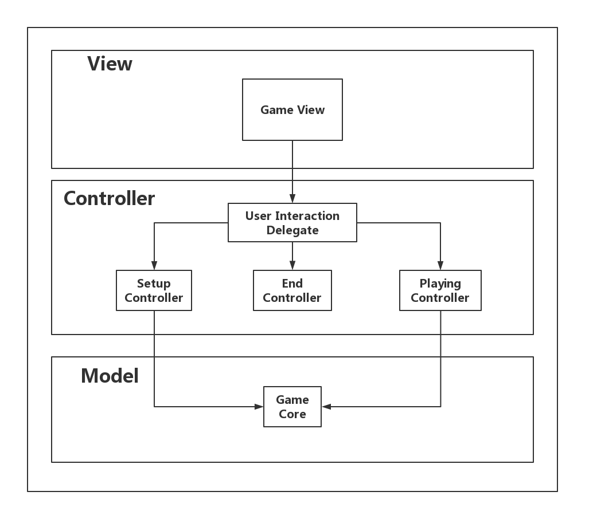
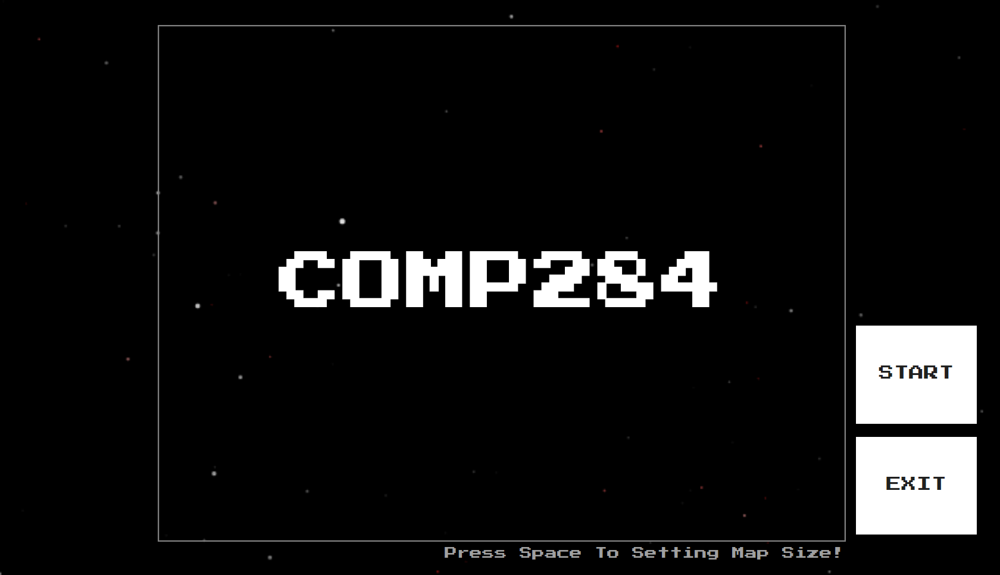
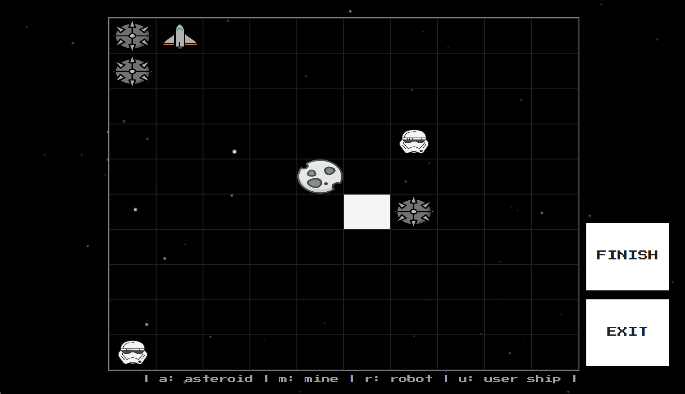
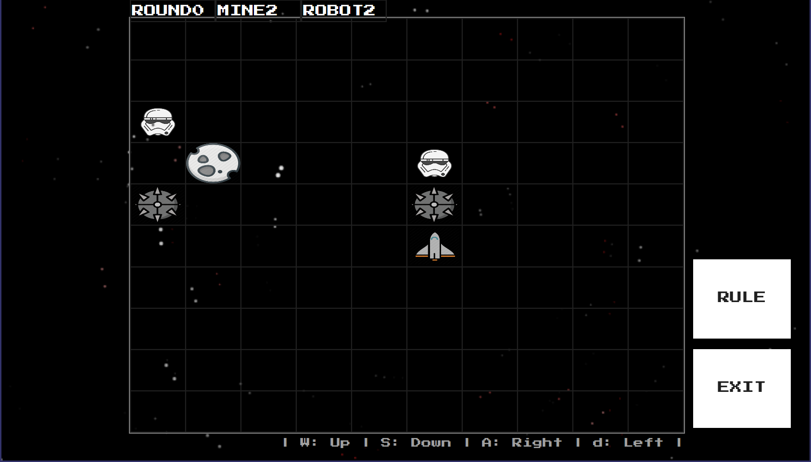
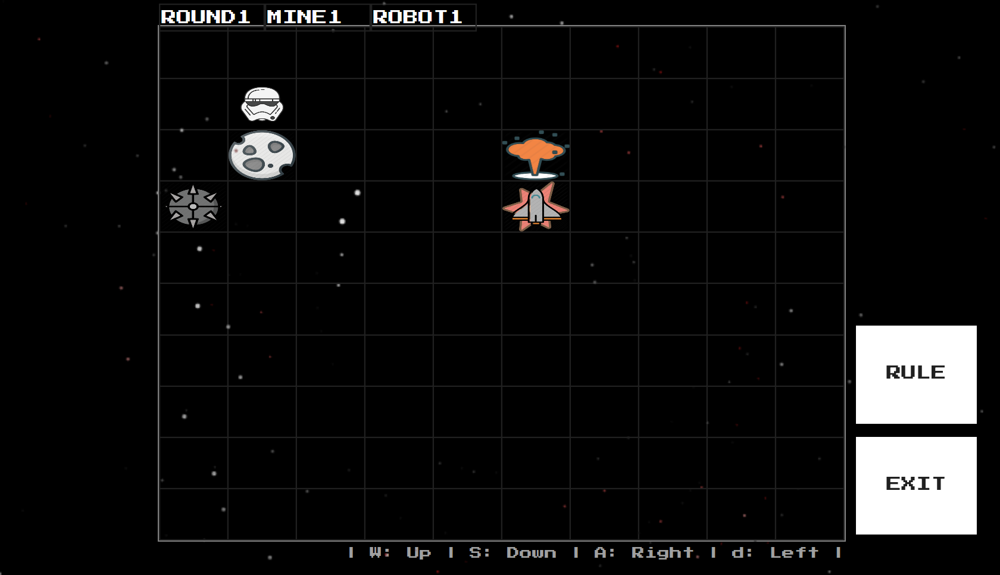
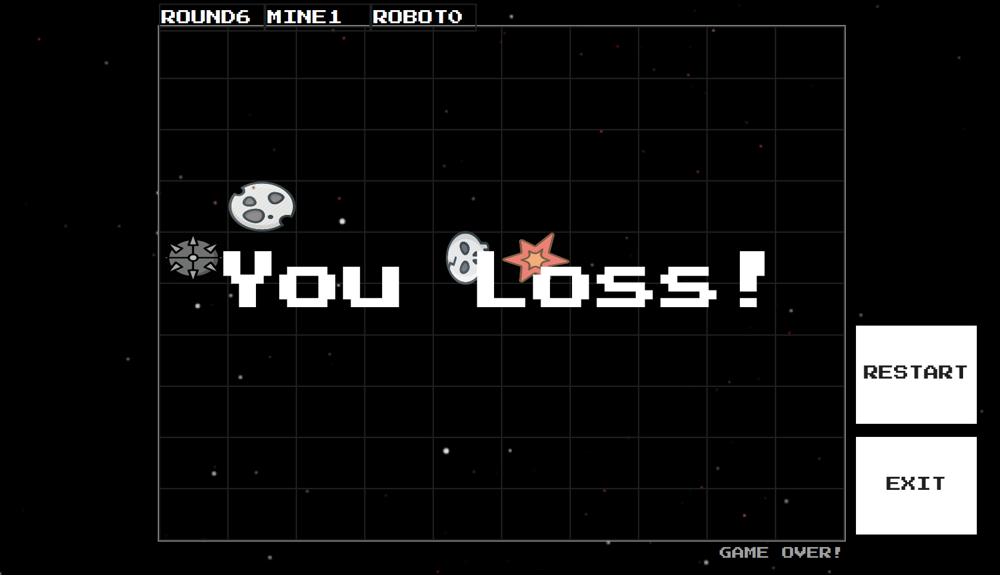
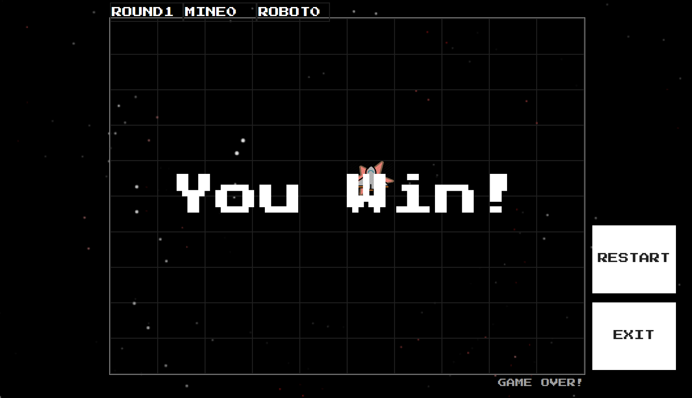

# Web-based Game Document
## 1. Overview
The document will mainly describe a web-based game and the design of its code. The game can be obtain online: https://student.csc.liv.ac.uk/~sgyxu24/game.html 
The game is designed for assignment 03 of the module COMP284 "Script language". It is based on JavaScript, HTML and CSS. Additionally, the game supports all commonly used browsers (includes Google Chrome, Mozilla Firefox, Microsoft Internet Explorer 9 or higher) and on all commonly used platforms (e.g., Linux derivatives and Microsoft Windows.

## 2. Requirements:
### 2.1 Overview:
The JavaScript program implements a simple game that consists of three stages, setup, play and end. During the play stage the game proceeds in rounds. The game is played on a grid with 10 x 10 cells, surrounded by a wall, and involves our hero, controlled by the user, and a bunch of evil killer robots, controller by the computer (that is, your program). Our hero hunts for treasure on the grid while the killer robots hunt our hero. The user and your program are the two players of the game.
### 2.2 Game Rules:
##### 2.2.1 Setup Stage:
The game always starts in the setup stage. During that stage the user is shown the grid and can place three different types of objects on the cells of the grid:
* by clicking on a cell and typing a number between 1 and 9, a treasure is placed on a cell, the number indicates the value of the treasure;
* by clicking on a cell and typing the letter "o", an obstacle is placed on a cell;
* by clicking on a cell and typing the letter "h", the hero is placed on a cell.
* by clicking on a cell and typing the letter "k", the a killer robot is placed on a cell.

There is no limit on the number of treasures, obstacles and killer robots, but there is only one hero. No cell can contain more than one object and once an object has been placed on a cell it cannot be changed. If the user tries to change the object placed on a cell, then an error message should be shown. If the user types a character that is not among 1 to 9, "o", "h" and "k", an error message should be shown. 
In addition to the grid, the user must have a means to end the setup stage of the game, for example, via a button. If the user tries to end the setup stage of the game without placing the hero, then an error message should be shown and the user remains in the setup stage. Otherwise the game continues with the play stage.

##### 2.2.2 Playing Stage:
At the start and during the play stage, the user is again shown the grid, initially with all the objects that have been placed on the grid, plus additional status information: The number of the round currently played, the number of treasures still on the grid, the user's score, the killer robots' score. Initially, round 1 is played and both the user's score and the killer robots' score is 0. In addition, there must be the possibility for the user to end the play stage at any time, for example, via a button. 
While in the play stage, the game proceeds in rounds, each round starting with the user's turn followed by the computer's turn. 
During his/her turn, the user can attempt to move the hero horizontally or vertically on the grid by typing one of four letters:
* "a" attempts to move the hero one cell to the left,
* "d" attempts to move the hero one cell to the right,
* "w" attempts to move the hero one cell up,
* "s" attempts to move the hero one cell down.

If the user types any other character, then an error message should be shown, the user's turn does not end, and the user can type another character. If the attempted move would result in the hero ending up outside the grid or on a cell occupied by an obstacle, then an error message should be shown, the attempt to move fails, the hero does not move, and the user's turn is over. Otherwise, the attempted move is successful and the hero changes cells. If the hero ends up on a cell occupied by a killer robot, then our hero dies, the game is over and the game proceeds to the end stage. If the hero ends up on a cell that contains a treasure, then that treasure is removed from the grid and the value of the treasure is added to the user's score (if the last treasure is removed, then the game proceeds to the end stage). After the hero changed cells and possibly collected a treasure or died, the user's turn is again over.
During the computer's turn your program attempts to move each of the killer robots in some order. Unlike the hero, the killer robots are not only able to move horizontally and vertically but also diagonally. Just like the hero, each killer robot only moves at most one cell in a turn. If the hero is in a cell immediately surrounding a killer robot, then that killer robot must move to the cell occupied by the hero; the hero dies, the computer's turn and the round ends, the number of rounds played is increased by one, and the game moves to the end stage. If the hero is not in a cell immediately surrounding a killer robot, but one or more of those cells contains a treasure, then the killer robot must move to one of those cells, the treasure on that cell is removed from the grid, and the value of the treasure is added to the killer robots' score. If none of the surrounding cells contains the hero nor a treasure, then a killer robot can move to an arbitrary surrounding cell provided that this move does not take it to a cell that is off the grid or occupied by an obstacle or by another killer robot. A killer robot is not allowed to stand still if it can move and the order in which killer robots attempt to move must be such that the number of robots that move is maximised. However, if a killer robot cannot move at all, then the computer should simply proceed to the next killer robot. Once an attempt has been made to move each of the killer robots, the computer's turn and the current round ends, and the number of rounds played is increased by one.

##### 2.2.3 End Stage:
The play stage ends if one of the following conditions becomes true
the user ends the play stage (by pressing the button provided for that);
* the hero dies;
* there are no treasures left on the grid;
* neither the hero nor any of the killer robots is able to move.

Once the play stage has ended, the game is in the end stage. In the end stage the program determines the outcome of the game. The outcome is a win for user if the hero is still alive and the user's score is higher than the killer robots' score; the outcome is a win for the computer if the hero is dead or the killer robots' score is higher than the user's score; otherwise, the outcome is a draw. The program should display a message indicating the outcome of the game and then stop. During the end stage the program should not react to any user input or actions.

## 3. Design
The application using model-view-controller design pattern.

### 3.1. Model
Game Core: It is the model part of the game. It will calculate the game state and storage all game data.

### 3.2. View
* Game View: the view part of the game which consists of 4 parts namely, setup canvas, playing canvas, end canvas and button canvas;

### 3.3. Controller
*	User Interaction Delegate: It is the Delegate for the game view. It will receive information and events from game view and send them to matching game controller.
* Setup Controller: Handle user input during the setup stage;
* Playing Controller: Handle user input during the playing stage;
* End Controller: Handle user input during the end stage;

## 4. Storyboard
### 4.1 Setup

### 4.2 Playing

### 4.2. End

