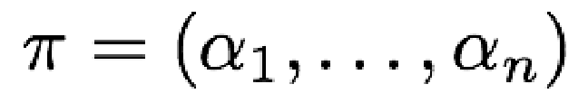
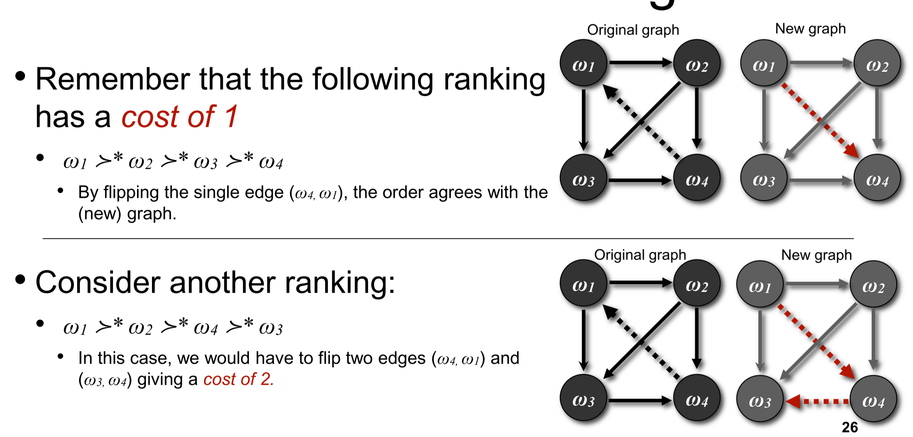
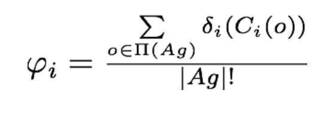
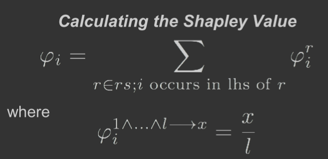
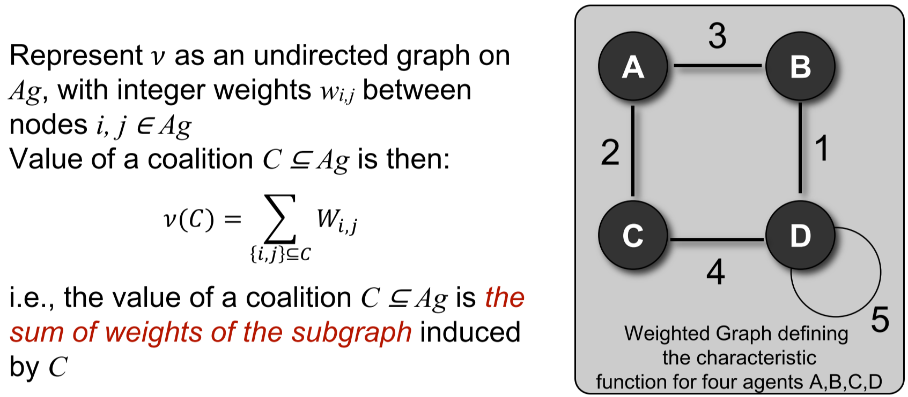

## 1. Chapter 02 Intelligent Agent
#### 1.1 Definition
##### 1.1.1 Overview
An agent is a computer system situated in an environment, which is able to autonomously act in the environment to meet its delegated objectives;
##### 1.1.2 Agent and Object
* Agents are autonomous;
* Agents are smart;
* Agents are active;
##### 1.1.3 Agent and Expert System
* Expert System typically focus on a special domain;
* Agent is situated in an environment;
##### 1.1.4 Agent and AI
* Agent is not designed to solve all the problems of AI;

#### 1.2 Environment
##### 1.2.1 Fully observable vs partially observable
* Fully Observable: Complete, accurate, up-to-date information about the environment can be obtained;
* Partially Observable: Complete information is inaccessible;
##### 1.2.2 Deterministic vs non-deterministic
* Deterministic: Action has a single guaranteed effect;
* Non-deterministic: Action may cause an uncertain effect.
##### 1.2.3 Static vs dynamic
* Static: The environment will not be changed before the agent act;
* Dynamic: The environment may be changed before the agent act.
##### 1.2.4 Discrete vs continuous
* Discrete: Agent has finite actions in the environment;
* continuous: Agent has infinite actions in the environment;
##### 1.2.3 Episodic vs non-episodic
* Episodic: Agent's current decision will not affect its future decision
* Non-Episodic: Agent's current decision will affect its future decision;
##### 1.2.3 Real Time
* Real Time: Time will affect the evaluation of an agent's performance;

#### 1.3 Properties
##### 1.3.1 Reactivity
* A reactive system keeps on interacting with the environment, and responds to changes occurred;
##### 1.3.2 Proactiveness
* A proactive system takes an initiative goal, and decides action through both of the goal and events;  
##### 1.3.3 Social Ability
* Ability to interact with other agents by cooperation, coordination, and negotiation.
* cooperation: working together as a team to achieve a shared goal.
* Coordination: managing the interdependencies between activities.
* Negotiation: reaching agreements on common interest.
##### 1.3.4 Other Properties
Mobility, Rationality, Veracity, Benevolence, Learning/adaption;
#### 1.5 Utility
###### 1.5.1 Expected Utility
* Definition: Expected utility is the expected value of an agent to obtain in an environment;
* 计算公式:
* Calculation: multiply the value to the agent of each possible outcome of the action by the probability of that outcome occurring and then summing those numbers;
* Optional Agent: The optimal agent in an environment is the agent with maximal expected utility;
* Example:
###### 1.5.2 Predicate Task Specification
* Definition: A special case of assigning utilities to histories is to assign 0 (false) or 1 (true) to a run.
* How to: If a run is assigned 1, then the agent succeeds on that run, otherwise it fails.
###### 1.5.3 Achievement and Maintenance Tasks
* An achievement task is specified by a set G of “good” or “goal” states: G ⊆ E;
    - The agent succeeds if it is guaranteed to bring about at least one of these states
* A maintenance goal is specified by a set B of “bad” states B ⊆ E.
    - The agent succeeds in a particular environment if it manages to avoid all states in B

## 2. Chapter 04 Practical Reasoning Agents
#### 2.1 Definition
Practical reasoning is reasoning directed towards actions basing on agent's desires, values and believes;
#### 2.2 Component
* Deliberation:
    - what state of affairs we want to achieve;
    - Outputs: intentions.
* Means-ends reasoning:
    - how to achieve these states of affairs;
    - outputs: plans.
#### 2.3 Blocksworld
##### 2.3.1 Predicate
* On(x,y): Object X on the top of object y;
* OnTable(x): Object X is on the table;
* Clear(x): Noting is on the top of object x;
* Holding(x): arm is holding x;
##### 2.3.2 Action
* Stack(x, y): Place an object on the top of another object;
* Unstack(x, y): Pick an object up from the top of another object;
* Pickup(x): Pick up an object from the table;
* Putdown(x): Putdown an object to the table;
#### 2.4 Formal Representation
##### 2.4.1 Action
* preconditions 𝑃𝛼𝑖 ,
* delete list 𝐷𝛼𝑖,
* add list 𝐴𝛼𝑖;

##### 2.4.2 Problem
* B0 is the set of initial beliefs;
* Ac is the set of actions (changes the beliefs);
* I is a goal (or intention);

##### 2.4.3 Plans
* 定义: a sequence of actions
* 可接受的Plan: A plan is said to be acceptable if and only if, each action will have true pre-condition;

##### 2.4.4 Implementation
* Basic Model:
    - see(): Observe the environment to generate perceptions (Environment ==> Perceptions);
    - action(): Produce the agent’s actions (Internal States ==> Actions);
    - next(): Update the Internal state (Internal States and Perceptions ==> Internal States);
* Example Implementation:
    - brf(): the belief revision function (From perceptions to believes)
    - Options(): Generate all possible intentions;
    - filter(): decide the final intention;
    - sound(): check if the original plan is a correct for current Believes and intentions;
    - plan(): Use mean-ends reasoning to produce a plan for the intention;
    - execute(): Execute each action in a plan;
    - succeeded(): Agent believes that the intention has achieved;
    - impossible(): Agent believes that the intention is achievable;
    - reconsider(): Agent believes that the intention need to be reconsidered (Optional);

## 3. Chapter 11 Nash Equilibrium
A strategies profile is in Nash equilibrium if all players cannot deviate to obtain a higher payoff.  
* The outcomes (C, D) and (D, C) are pure strategy Nash equilibria.
* Because, if Player 1 does action_C, the best action for player 2 is action_D.
* Similarly, ...

## 4. Chapter 12 Voting
#### 4.1 Plurality
* Winner is the one with the largest number of points.
* Tactical Voting: Voter may vote a candidate who is not true preference profile.
* Condorcet’s Paradox: no matter which outcome we choose, most voters will be unhappy with the outcome
#### 4.2 Sequential Majority Elections
* Reduce a general election to a series of pairwise elections.
* Anomalies: fix an agenda using a majority graph for a special candidate to win;

* Condorcet Winner: winner for every possible agenda;
#### 4.3 Borda Count
* Calculates the Borda Count for each candidate, the winner is the candidate with the highest value;
#### 4.4 Instant Runoff Voting
* Counting proceeds in rounds, remove the last place candidate until there is only single candidate remained.
#### 4.5 Slater Ranking
* Winner is the candidate with minimal cost to be Condorcet Winner;

## 5. Chapter 13 Forming Coalition
#### 5.1 Objection
A set of agents C rejects an outcome of the grand coalition when there is another outcome for C in which all members of C obtain better benefits.
#### 5.2 Core
the core of a grand coalition is a set of outcomes (< 𝑥1,…, 𝑥𝑛 >) in which each of them follows:;
#### 5.3 Shapley Axiom and Value
##### 5.3.1 Axiom
* Symmetry: Agents that make the same contribution should get the same payoff;
* Dummy Player: Agents that make not synergy should get what they can earn on own.
* Additivity: If games are combined, the value an agent gets should be the sum of the utility of each individual game.
##### 5.3.1 Value
The Shapley value of an agent is the average amount of its expected contribution to a coalition.
* Formal Function: .
* Induced Subgraph: .
* Marginal Contribution Nets: .
#### 5.4 Representing Characteristic Functions
* Induced Subgraph:  
    - Represent 𝜈 as an undirected graph;
    - .
* Marginal Contribution Nets:
    - Represent 𝜈 as a set of rules;
    - .

## 6. Chapter 16 Abstract Argumentation System
#### 6.1 Conflict Free Positions
* A position S is conflict-free if no member of S attacks another member of S.
#### 6.2 Mutually Defensive Positions
* A position S is mutually defensive if every element of S, that is attacked, is defended by some element of S.
#### 6.3 Admissible Positions
* A position that is conflict-free and mutually defensive is admissible.
#### 6.4 Preferred Extension
A position S is a preferred extension if S is admissible and no superset of S is admissible.
* An argument is sceptically accepted if it is a member of every preferred extension
* An argument is credulously accepted if it is a member of at least one preferred extension
#### 6.5 Grounded Extension
A grounded extension is the least questionable position.
* Arguments are guaranteed to be acceptable if they aren’t attacked.
    - they are IN
* Arguments attacked by those that are in are therefore unacceptable
    - They are OUT
