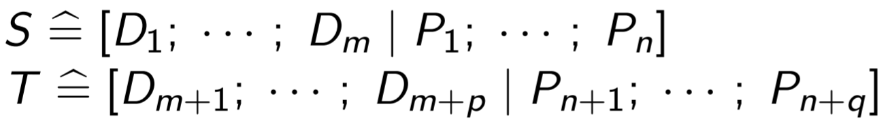
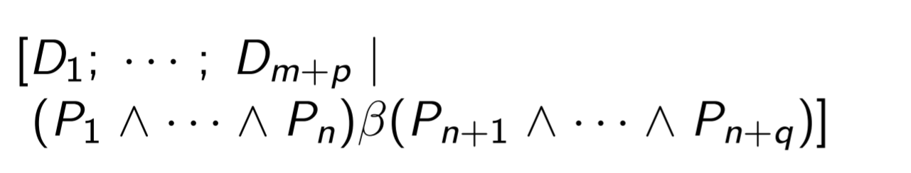
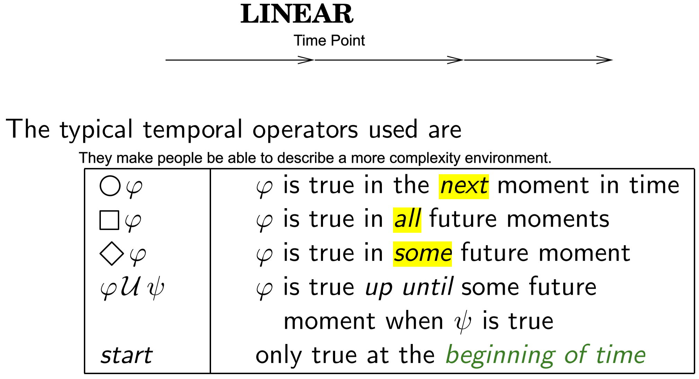
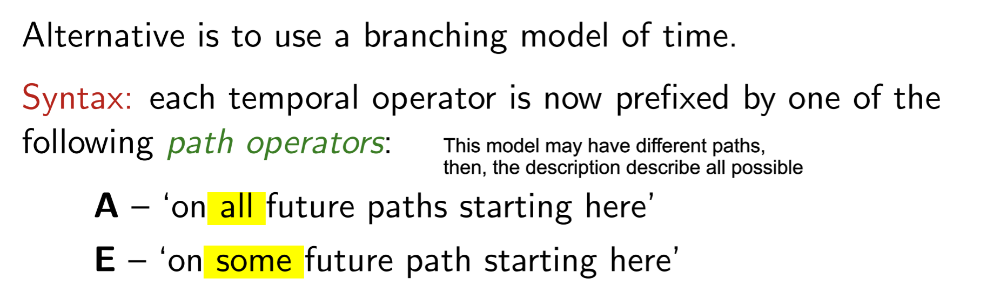
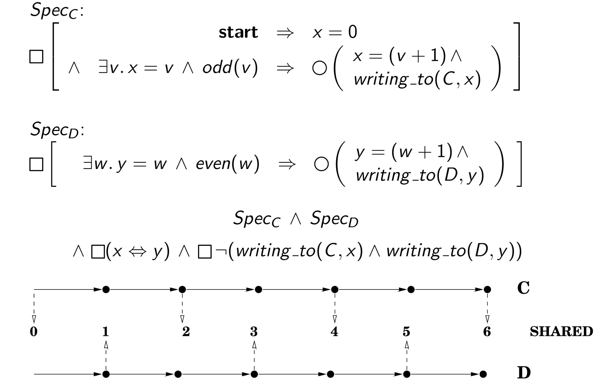

## 2. Z Language
#### 2.3 Data Structure
###### 2.3.1 Set
###### 2.3.2 Seq
* 特点:
    - 有顺序,
    - 有重复.
* 表达方式:
    - `<,...,>`: 用enumeration表示一个Sequence;
    - `seq Type`: 表示由该type元素构成的所有的Sequence
* Seq的本质:
    - Sequence的本质是一个function, 因此任何对function的操作都可以直接用在sequence上;
    - seq T = {f: N1⇸T | domf = 1..#f}
* 支持操作:
    - `σ1⌢σ2` Concatenation:
        返回一个将sequence σ1 和 σ2 的内容结合在一起, 按照 σ1, σ2之间的顺序和它们内部的元素顺序排序的数组; `<1,2>⌢<2,4> = <1,2,2,4>`;
    - `rev σ` Reverse:
        返回一个将 σ 内部的元素顺序颠倒的新数组; `#<1,2,3,4,5> = <5,4,3,2,1>`;
    - `#σ` Count:
        返回σ内部元素的数量; `rev<1,2,3,4,5> = 5`;
    - `sequence σ | set A` Filter:
        返回一个只含有A中元素的数组, 其中元素的顺序按照 σ 中元素排列的顺序; `<5,4,3,2,1>|{1,2,3} = <3,2,1>`;
    - `sequence σ after number n`:
        返回一个被移除前n个elements的σ; `<5,4,3,2,1>after2 = <3,2,1>`;
    - `map f σ`:
        返回一个用所有σ中element为function f 的input 生成的Output组成的结果的集合; `f(x) = 1+x; map f <1,2,3> = <2,3,4>`
    - `head σ`:
        返回数组的第一个值. 如果是empty数组, 那么返回undefined; `head <2,3,4> = 2; head ∅ = undefined`;
    - `last σ`:
        返回数组的最后一个值. 如果是empty数组, 那么返回undefined; `last <2,3,4> = 4; last ∅ = undefined`;
    - `front σ`:
        返回一个移除数组σ最后一个值的数组; `front<1,2,3> = <1,2>`;
    - `tail σ`:
        返回一个移除数组σ第一个值的数组; `tail<1,2,3> = <2,3>`;
###### 2.3.3 Bag  
* 特点:
    - 无顺序;
    - 可重复;
* 表达方式:
    - `[[,...,]]`: 使用enumeration和两个方括号表示bag;
    - `bag Type`: 使用定义表达所有由该type组成的bags的集合;
* 本质:
    - Bag的本质也是一个function, 因此任何对function的操作都可以直接用在Bag上;
    - bag T = {f: T⇸N1}
* 支持操作:
    - `x in B` Membership:
        检查element x是否在bag B中至少出现一次; `a in [[a,a,b,b]]`
    - `B1⊑B2`Sub-bag:
        B2中的元素出现频率比B1中的元素出现频率更高;`[[a,b]]⊑[[a,a,b,b]]`
    - `B # x` Count element:
        计算元素x出现在Bag B中的次数; `[[a,a,b,b]] # a = 2`;
    - `n⊗B` Scaling Bag:
        返回一个元素出现数量在原有的Bag B中增倍n次的新Bag; `2⊗[[a,b]] = [[a,a,b,b]]`
    - `B1⊎B2` Bag Union:
        返回一个包含B1和B2全部element的Bag;`[[a,b]]⊎[[a,a,b,b]] = [[a,a,a,b,b,b]]`
    - `items σ`:
        返回一个和Seq σ有相同元素的Bag; `items<a,b,a,b,c> = [[a, a, b, b, c]]`;

#### 2.2 Schema
###### 2.2.1
###### 2.2.2 Calculus
* 定义: Z-language 提供的一种使用 Propositional logic 去处理结合多Schema, 以此表达更加复杂的logic;
* 前提:
    - 被Propositional Connectiveness处理的两个Schema需要满足两个Schemas是type compatible的;
    - 如果两个Schemas是type compatible 意味着这两个Schemas的Common Variable是same type;
* Combination:
    - 将两个Opertion用特定的一元或者二元连接符号处理;
    - 例如: ;;

## 3. Temple Logic
#### 3.1 Basic Conception
###### 3.1.1 什么是Temple Logic
* TL 是Classic Logic的扩展, 经常被用于描述复杂的问题.
* 和Classic Logic比起来Temple Logic在语句中描述了不同的环境, 相同的语句在不同的环境中, 结果可能不同.
* 而转化不同环境的方式就是时间;
###### 3.1.2 Kinds
* Linear Model:
;
* Branch Model;
;
#### 3.2 Semantics
###### 3.2.1 Model
* Model = <S,R,π>
    - S 表示所有可能的状态;
    - R 表示状态之间转化的relations;
    - π : S → PPROP, 用来表示Properation和State之间关系的Function. 输入为State, 输出为当前state下的Properation
* Model = <N,π>
    - N: 是在Linear model中的简化模型, N表示所有有可能的State {s1,s2,s3...}
    - π : N → PPROP maps each moment in time to a set of propositions.
###### 3.2.2 Interpretation Relation
* |= 被用来解释Temple Logic的语义;
* 当世界为M并且描述的状态处在Index i时, `<M,i> |= ϕ`为真表示在state i时, ϕ成立.
* 也就是说 `<M,i> |= p iff p ∈ π(i)`;

###### 3.2.1 Operation
* Start: 表示逻辑描述的开始 `<M,i> |= start iff (i = 0)`;
* Next: 表示在接下来一个state, 某个properation为真 `<M,i> |= ○ϕ iff <M,i+1> |= ϕ`
* Sometime: 表示不确定什么时候某个properation为真, 但是最终一定会为真 `<M,i> |= ◇ϕ iff there is j(>i) and <M,j> |= ϕ`
* Always: 表示某个properation一直为真, `<M,i> |= ◻ϕ iff for all j, j>i <M,j> |= ϕ`
* Until: 表示某个properation一直为真, 直到另外一个Properation为真. `<M,i> |= ϕµψ iff there is j(≥i) so that <M,j> |= ψ and for all (j>)k(>i), <M,i> |= ϕ`
* Unless: 类似于Until但是和Until不同的是, Unless不保证ψ发生,这意味着有可能一直保持某个状态; `<M,i> |= ϕwψ iff<M,i> |= ϕµψ or <M,i> |= ◻ϕ`
#### 3.3 Extension
###### 3.3.1 Program and Temporal formulae  
* 一种将Program Pseudocode 转化为Temporal formulae的方式, formal并且准确的描述了, System的Actions;
* Style: `[[Program]]: program pseudocode → temporal formulae`
* Tranform: `[[x:=v; S]] = ∃w.nx = w ∧ (x = v(x/w) ∧ [[S]])`

###### 3.3.2 Refinement
* 细化Specification;
* 表示方法: ϕ ⇒ ψ (表示ϕ 细化了 ψ);
* 在细化后的Specification为True的情况下, 原本的Specification一定为True;
* Spec2 &rArr; Spec1
    - Spec1 = p ∧ ◇q;
    - Spec2 = p ∧ ○q;
###### 3.3.3 Concurrency
* 并发或者中断:
    - Concurrency: Components 之间相互不影响, 每个Component Simultaneouly执行自己的程序;
    - Interleaving: Components 之间相互不影响,一次只有一个Component可以执行, 所有每个Components都是周期性的运行;
* 同步或者异步:
    - Synchronous: 所有的Components的时间单位都是相同的, 因此每个component对next moment都有相同的概念;
    - Asynchronous: Components之间的时间的单位是不同的, 因此他们对next moment的概念不同;
###### 3.3.4  Communication
Temploral Logic 可以表示多种不同的Components相互交流信息
* Shared variables: 一种通过某些共享的变量来进行交流的方式;
    - 读或者写都是atomix的action;
    - 并且一次只有一个components进行读或者写;
    - 在Temporal Logic中实现Shared, 需要满足 1) 所有的Components都看到相同的数据, 2)而且能够看到数据的更新, 3) 在任何时候只有一个component能更新这个数据;
    - 如果在两个Components的Temporal Formula中存在Shared Variable (a in C1, b in C2): 那么我们需要 `◻(x ⇔ y)` 来满足1)和2), 用`writing to(C, x)`来表达Component C现在正在write variable x;  
* Message passing: 一种通过中间介质来进行交流的方式;
    - 信息交换快(几乎是瞬间发生的);
    - 信息交换通过两个方法snd()和rcv()
    - 
* Channel communication:
    - 组件之间通过Channel交流, 如果两个不存在Channel那么就不可能进行交流;
    - Synchronised Communication: 一次只有一个Components使用Channel, both读或者写;
* Linking specification:
    - 确定specification中components匹配的信息输入和输出形式. 如果出现对应的properation, 就表示Componnets之间进行Communication;
    - 例如存在两个Properations Set In and Out. 如果所有In 中的Properations都出现那么就表示, component 收到一个信息. 如果所有out中的Properation都出现那么就表示, Components 发送一个信息;
    - 所以一个存在Communication的system可以通过`Spec1 ∧ Spec2 ∧ Comms(Spec1, Spec2)`来表达, 其中`Comms(Spec1, Spec2)`, 表示交流在Spec1和Spec2中表示的properations
    - 如果 p ∈ Out(Spec1) and q ∈ In(Spec2), 那么就Comms(Spec1, Spec2)为 `◻(p⇒○q)`;
###### 3.3.5 Safety and Liveness
* Safety:
    - Something bad will not happen;
    - Expression: `◻¬ p`
* Liveness:
    - Something good will eventually happen;  
    - Expression: `◇ p`
* Fairness:
    - if something is required infinitely often, then it will be succeed infinitely often.
    - Expression: `◻◇required ⇒ ◻◇succeed`

## 4. Exam Question
#### 4.1 About Model Check
###### 4.1.1 Partial-Order Reduction
* Definition:
    - A technique
    - reducing the search space
    - requires pre-processing.
* Pre-process:
    - remove some executions basing on the formula verified.
* Motivation:
    - Asynchronous and interleaved concurrency
    - => too many possible executions.
    - But Exist equivalent representation of the formula;  
###### 4.1.2 Abstract
* Definition:
    - A technique
    - reduces an infinite state system to a finite state one.
* Under approximations:
    - removes irrelative to the properties checked;
* Over approximation:
    - replaces infinite values variables => finite values variables;

###### 4.1.3 On-the-fly model checking
* Model Check:
    - Check if a system S satisfies the specification ϕ
    - Through checking if there is a acceptable value for an auto~ BSx¬ϕ;
    - However, the auto~ is too large to construct and to check
* On-the-fly:
    - does not build the full product, but only the needed parts.
    - reduces space requirement
###### 4.1.4 Automata-theoretic Approach
* Motivation:
    - Model checking is labourious;
* Definition:
using a equivalence accepted_by(BAprogram × BA¬ϕ) = ∅ to check the model:
    - BAprogram:
        + a Buchi Automaton
        + all executions of a program;
    - BA¬ϕ
        + a Buchi Automaton
        + negation of the properties in specification
    - BAprogram × BA¬ϕ
        + a Buchi Automaton
        + specifies all executions and satisfies all negative properties;
    - accepted_by:
        + a function;
        + returns all accepted sequences of an automaton;
#### 4.2 About TL
###### 4.2.1 Dense and discrete model
* Dense:
    - for any two moments a and b, there is a moment c between a and b.
    - So there are infinitely moments between a and b;
    - Dense time models are the rationals and the reals.
* Discrete:
    - no moment between a and b;
    -  Discrete time models are the naturals or the integers;
###### 4.1.2 Until
(l ∧ a) U(l ∧ (l ∧ b) U c)
* 假设存在一个Model满足 ϕ = (l ∧ a) µ (l ∧ (l ∧ b) µ c) .
* 我们需要证明 ψ = l µ c is also satisfied.
* 在一个Model中如果ϕ满足, 意味着l一直满足直到某一时刻n(moment of time ) (l ∧ (l ∧ b) U c)满足;
* 因为(l ∧ (l ∧ b) U c)满足, 所以着l一直满足直到某一时刻c满足
* 这意味着l一直满足直到c满足(ψ满足).
###### 4.2.3 Infinitely Often
* forced to occur: at least once

#### 4.3 About TL
###### 4.3.3 Refinement
* Definition:
    - to refine specifications as part of program development;
* Signal:
    - ϕ ⇒ ψ means for all π, if hN, πi |= ϕ then hN, πi |= ψ.
* Motivation:
    - reduces # of models;
    - reduces # of execution sequences.
