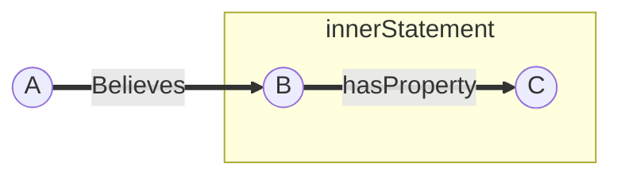

### 1. 关于 RDF and RDFS
#### 1.1 RDF reification:
###### 1.1.1 Define the meaning of reification
Reification is a mechanism in RDF to turn a statement into a resource so that a statement can be referred to through an identifier.
###### 1.1.2 Explain what Reification is used for.
Reification is used for making a statement about other RDF statements.  
###### 1.1.3 Illustrate its use with an example.
A believes that B hasProperty C.

#### 1.2 RDF(S) Entailment
###### 1.2.1 Define the meaning of Entailment
RDF(S) Entailment is a process to use the special semantics of the RDF(S) graph vocabularies for deriving implicit triples.
###### 1.2.2 Describe how does simple entailment work.
In the simple entailment, two rules below can be applied on any statement without any extra conditions to derive implicit triples:
* u a x => u a \_:n (The object of a statement can be weakened to a blank node, as long as the subject and predicate stay the same)
* u a x => \_:n a x (The subject of a statement can be weakened to a blank node, as long as the subject and predicate stay the same)

#### 1.3 SPARQL
###### 1.3.1 What is SPARQL for?
SPARQL is the query language for querying RDF, which allows to:
* Query from structured and semi-structured data;
* Query unknown relationships;
* Perform complex joins from distributed databases;
* Transform RDF data types;
###### 1.3.2 Main principles of SPARQL
Pattern Matching:
* Describe the queried RDF graph;
* Graphs that match the description produce a result;
###### 1.3.3 Types of SPARQL queries
* SELECT: Query a RDF Resource;
* DESCRIBE: Query the descriptions of a RDF resource;
* CONSTRUCT: Construct a RDF Graph described by graph pattern;
* ASK: Check if the graph pattern exists;

### 2. 关于 OWL
#### 2.1 OWL and RDFS
* RDF/RDFS describes subject predicate object triples and basic subsumption relations;
    - Supports Very efficient deduction/querying but poor expressivity;
    - Provides Classes, Properties, Hierarchies, Domain and range;
* OWL extends RDF Schema to a knowledge representation language;
    - Support reasoning and formal semantics;
    - Provide Logical expressions, (in)equality, properties restriction, enumeration and Boolean combination;

#### 2.2 OWL Sublanguage
###### 2.2.1 Expressive power of OWL-DL and OWL-Lite with example of axiom types;
* OWL-Full:
    - It is all syntactic freedom of RDF which uses all OWL primitives;
    - It provides high expressiveness but incomplete or inefficient reasoning;
* OWL DL:
    - It is sublanguage of OWL Full which imposes restrictions on constructors;
    - It provides a efficient reasoning;
* OWL Lite:
    - It is sublanguage of OWL DL which does not support nominals and XML datatypes
    - It provides not tractable reasoning.
###### 2.2.2 What are the three profiles supported by OWL2?
Sublanguages of OWL2 reduces "expressive  power" to improve "reasoning efficiency";
* OWL 2 EL: efficient reasoning performance;
* OWL 2 RL: integration of OWL and rules;
* OWL 2 QL: useful to query data;
#### 2.3 OWL restriction
###### 2.3.1 When do you use owl:someValuesFrom and owl:allValuesFrom on the same property?
* "owl:someValuesFrom :Class_B": ":someValuesFrom" is existential quantification which will creates a new class. In addition, at least one value of the ":Property_A" in the class is instance of ":Class_B";
* "owl:allValuesFrom :Class_B": ":someValuesFrom" is universal quantification which will creates a new class. In addition, all values of the ":Property_A" in the class are instance of ":Class_B";
* Use both two quantifications when we closure the value of a property to avoid any error deductions
    - for example, the topping of the vegetable pizza can only be vegetable topping and there is at least one kind of vegetable topping;  
###### 2.3.2 OWL constructs
* "owl:hasValue :Instance_C": "owl:hasValue" is cardinality restriction which will creates a new class. In addition, the value of the ":Property_A" in the class is exact ":Instance_C";
* "owl:disjointWith :Class_D": "owl:disjointWith" is a restriction which means no individual can be at the same time an instance of both classes involved.

### 3. 关于 Ontology
#### 3.1 Ontological
###### 2.2.1 Definition of Ontology
An ontology is a formal, explicit specification of a shared conceptualisation;
* Formal: an ontology should be machine-readable;
* Explicit: Concepts and constraints used are explicitly defined;
* shared: Knowledge captured by ontology is accepted by a group;
* conceptualisation: an abstract model of some real phenomenon.  
###### 2.2.2 Definition of Ontology Commitment
Agreement on the meaning of the vocabulary used to communicate and share knowledge.
###### 2.2.3 Benefits of having formal Ontology
* Make the automatic deduction;
* Make sure precision of definition (exclude any unintended meaning);
* Provide Standardise data structures;
* Provide the data element with a legal value (Thing not String);
###### 2.2.4 Open World Assumption
* anything might be true unless it has been proven false;
* everything that we don’t know is undefined;

#### 3.2 Ontological Alignment
###### 3.2.1 Benefits of sharing ontologies
* Improve search accuracy;
* Improve integration of data;
* Improve Interoperability of processes (Avoid misunderstanding);   
###### 3.2.2 Definition of the correspondence between two entities
a correspondence between two entities is a tuple which describes the relationship between the two entities;  
* The entity can be classes, properties and instances;  
* The relation can be Equivalence, Subclass, Disjointness between classes or properties;
* and the Equivalence, Difference, Instance between instances
###### 3.2.3 Ontology alignment and Semantic Integration
* Semantic integration is the process to interrelate information from different sources in cognitive level;
* Ontology is a computational representation of the cognitive level so that, it is the basis of semantic integration;
* Ontology alignment is the process of determining correspondences between semantically entities in Ontology.
###### 3.2.4 Measures used to evaluate alignments wrt to some standard
* Competence benchmarks: Measure the competence with a set of tasks;
* Comparative evaluation: compare the results of single task on various systems or various tasks on a single system;
* Application-specific evaluation: compare the output of various systems on the particular application instead of considering alignments;  
###### 3.2.5 What are the techniques that can be used for aligning ontologies?
* Syntactic approaches: Based on the comparison between the labels of entities;
* Instance-based mapping: Based on instance sets;
* Language-based approaches: Based on the synonym database;
* Taxonomy comparison: Based to identify the common parents/children;
###### 3.2.6 pre-processing
* Stop word removal: remove common words;
* Tokenization: extract term;
* Stemming: distil the core of a root form;
#### 3.3 Linked Data
###### 3.3.1 Definition for Linked Data
Linked Data refers to a set of best practices for publishing and interlinking structured data on the Web.
###### 3.3.1 Principles for defining linked data
1. Use URIs to identify things;
2. Use HTTP URIs so that these things can be referred;
3. Provide useful information about the thing when dereferenced;
4. Include links to related URIs in the exposed data;
    a. Link the data;
###### 3.3.1 Definition and usage of Vocabulary
