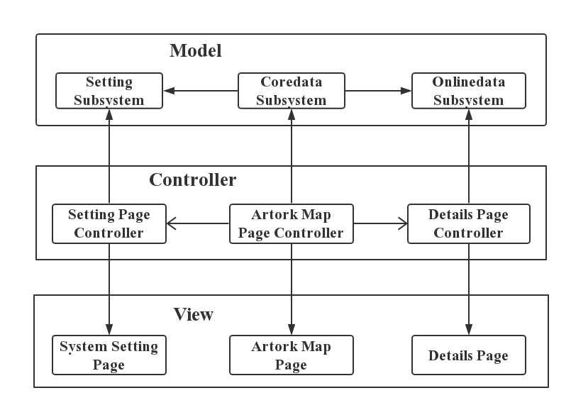
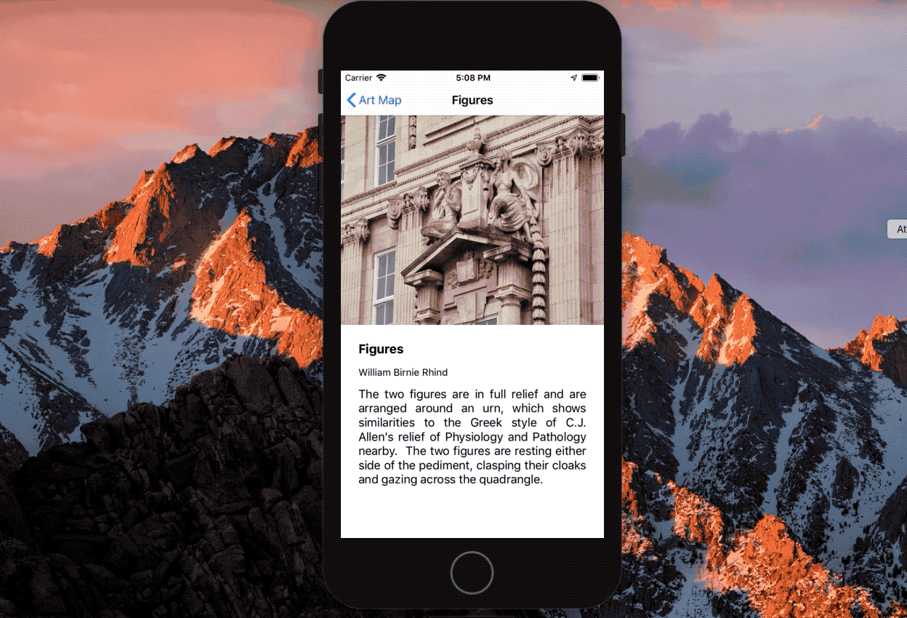

# Assignment 02 Document
## 1. Overview
The document will mainly describe the functions of the application and the design of its code.

The application is designed for assignment 02 of the module COMP327 “Mobile Computing”. The programming language is swift 4.2 and the target environment is iOS 12.0.

## 2. Functions
The application will retrieve a JSON data about the artworks in the campus from a web service and will load the image of these artworks through a path referenced in the JSON data. Then, this information will be shown on the map and the table on the main page. In addition, the application implements all requirements in the document.

### 2.1.  Basic Functions in the requirement doc
* Initially, the application will present a map centred on user’s current location and at a reasonable level of zoom (Both of the latitude delta and longitude delta equal 0.002)

* All artworks are presented on the table and these artworks are grouped by building and ordered by distance from the current location.

* On the map, a number of annotation marks will indicate the building where the artworks locate and when user taps on an annotation, the application will display an image and information for all artworks available within the building

### 2.2. Additional Functions in the requirement doc
* The application implements an alternative layout in landscape view.

* The application uses the NSURLCache class to store the results of the HTTP requests (image data).

* The application provides a searching bar which allows the user to filter the result displayed in the table.

* The information about the artworks are stored in the core data and the application will be synchronising the app on start-up to check any modification from the web server.

### 2.3. Additional Function not in the requirement doc
* NSCache class to store the result of core data requests.

* The user can decide if the searching results will include the building name

* The searching model can change between the fuzzy searching with precise searching.

* The application implements an alternative layout for different devices.

## 3. Design
The application using model-view-controller design pattern.

### 3.1. Model
* "Setting subsystem": manage the setting file for the application.

* "Coredata subsystem": request and update the core data. It will cache the result of the request by the NSCache class.

* "Online data subsystem": download and update the data from the web browser. In addition, it will cache the result of HTTP request by the NSURLCache class.

### 3.2. View
* Artwork Page: it is the main view of the application which contains a map, table and search bar.

* Detail Page: it is used to provide information and image of a specified artwork to the user.

* Setting Page: it is used to change the setting of the application.

### 3.3. Controller
*	Artwork Page Controller: The view controller of "Artwork Page" and it implements the UIViewController, MKMapViewDelegate, CLLocationManagerDelegate, UISearchBarDelegate, UITableViewDataSource, UITableViewDelegate.

* Detail Page Controller: The view controller of  "Detail Page". The image of the artwork will be loaded asynchronously during initiating the page.

* Setting Page Controller: The view controller of  "Setting Page". It implements the UITableViewController.

## 4. Storyboard
### 4.1 Functions

### 4.2. Rotation

